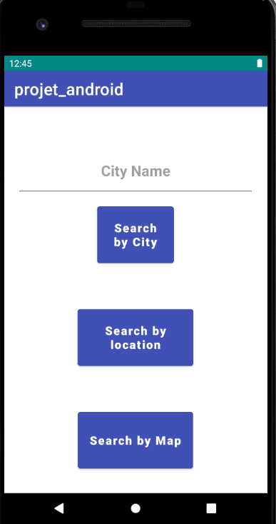
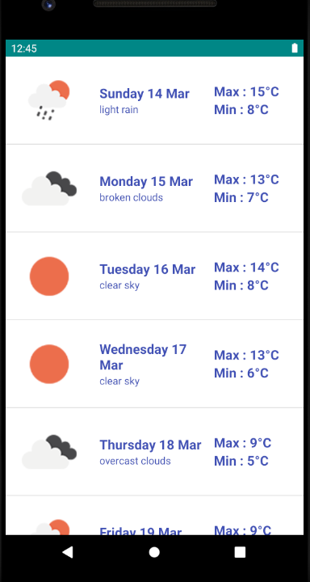
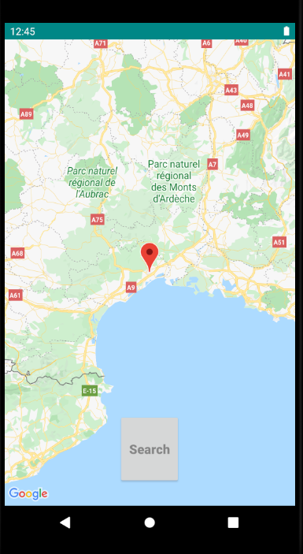

 # Projet Android API météo
 
 
 ## Ce projet utilise l'api de météo : https://openweathermap.org/api/one-call-api .
 
 
 ### MainActivity:
 
 La première activité permet de choisi de quelle manière on veut chercher les relevés météo sur 7 jours avec les températures maximale et minimale.

 On peut soit chercher par : 
  
  - nom de ville :  WeatherPerCityActivity
  
  - Localisation de l'appareil : WeatherPerLocationActivity
 
  - Position sur carte GoogleMap : MapsActivity
  

### WeatherPercityActivity:

L'activity WeatherPerCityActivity fonctionne en prenant en paramètre le nom de la ville qui à était saisi sur l'activity précédente. 

Pour cette activity on utilise exceptionnellement deux requêtes. En effet l'api qui permet de récupérer les données sur 7 jours ne fonctionne que sur une position avec les coordonnées de latitude et longitude.  
Comme nous avons seulement le nom de la ville comme données il fallait un moyen de récupérer les coordonnées de la ville. Pour pallier à ce problème nous avons décider d'utiliser une première requête vers l'api https://openweathermap.org/current qui nous permet de récupérer seuelement les coordonnées de la ville.    
Puis nous utilisons ces coordonnées de la ville pour récupérer les prévisions sur 7 jours.

Cette solution n'est pas forcément la plus logique et nous aurions pu procéder autrement mais nous avons décider d'utiliser ces deux requêtes pour tester l'imbrication de requêtes. 

### WeatherPerlocationActivity:

Cette activity permet de récupérer la météo en fonction de la localisation de l'appareil.
Elle est très similaire à la précendente la seule différence est que nous profitons d'avoir directement la longitude et latitude de la position pour ne faire qu'une seule requête.

Le code de cette application est clairement dupliqué de l'activité WeatherPercityActivity mais nous avons décider d'opérer comme cela pour garder le projet clair et plus lisible. 
Sur une application en production il faudrait bien évidement refactor le code pour que les recherches par ville, par localisation et par Maps pointe toute sur la même activity.

### MapsActivity:

La dernière activity de notre application utilise l'api GoogleMaps pour récuper une carte googleMap.
Avec cette carte on peu placer notre marqueur ou on le veut dans le monde pour.  
On envoi ensuite les coordonées du marqueur à WeatherPerlocationActivity pour afficher les températures.

